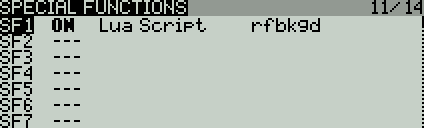

# Rotorflight Lua Scripts for OpenTX and EdgeTX

**Rotorflight** is a _Flight Control_/_FBL_ Software Suite for traditional single-rotor RC helicopters. It is based on Betaflight 4.2, enjoying all the great features of the Betaflight platform, plus many new features added for helicopters. Rotorflight borrows ideas and code also from Heliflight3D, an earlier fork of Betaflight for helicopters.

**Rotorflight Lua Scripts** is a package of OpenTX/EdgeTX Lua scripts for accessing and configuring the Rotorflight FC from the transmitter.

Rotorflight does **NOT** support multi-rotor 'drones', nor airplanes; it is only for traditinal RC helicopters, including co-axial and tandem helicopters.

## Requirements

- OpenTX 2.3.12 or EdgeTX 2.5.0 or later transmitter firmware
- A receiver supporting remote configuration:
  - a FrSky Smartport or F.Port receiver, _or_
  - a Crossfire v2.11 or newer receiver, _or_
  - an ELRS 2.0.1 or newer receiver

## Installation

Please download the latest version from github:

 - https://github.com/rotorflight/rotorflight-lua-scripts/releases

and copy the contents of the SCRIPTS folder to your transmitter.

You will know if you did this correctly if the `rf.lua` file shows up in the `/SCRIPTS/TOOLS` directory. Also *Rotorflight conf* should now show up in the *Tools* menu of your transmitter.

### Copying the SCRIPTS folder

USB Method

1. Connect your transmitter to a computer with an USB cable.
2. Open the new drive on your computer.
3. Unzip the file and copy the SCRIPTS folder to the root the new drive.
4. Eject the drive.
5. Unplug the USB cable.

SD Card Method

1. Power off your transmitter.
2. Remove the SD card and plug it into a computer.
3. Unzip the file and copy the SCRIPTS folder to the root of the SD card.
4. Eject the SD card.
5. Reinsert your SD card into the transmitter.
6. Power up your transmitter.

If you copied the files correctly, you can now go into the *Tools* menu on your transmitter and access the Rotorflight Configuration tool. The first time you run the script, a message 'Compiling...' will appear in the display before the script is started. This is normal and is done to minimise the RAM usage of the script.

## Usage
See the [Lua Scripts Wiki page](https://github.com/rotorflight/rotorflight/wiki/Lua-Scripts).

## Background script
The optional background script features *Real Time FC Clock synchronization* and the *Adjustment Teller*. 
- RTC synchronization will send the time of the transmitter to the flight controller. The script will beep if RTC synchronization has been completed. Blackbox logs and files created by the FC will now have the correct timestamp.
- The *Adjustment Teller* will [tell you](https://www.youtube.com/watch?v=rbMiiWhzhqI) what adjustment has been made. Currently it only works with s.port/f.port telemetry and telemetry sensors 5110 and 5111 should be discovered/added. It supports all adjustments except profile adjustments. 

The background script can be setup as a special or global function in OpenTX. The image below shows how to configure the background script as a special function. By doing this, the script will automatically run as soon as the model is selected.

## Building from source on Linux

- Be sure to have `make` and `luac` in version 5.2 installed in the path.
- Run `make` from the root folder.
- The installation files will be created in the `obj` folder. Copy the files to your transmitter as instructed in the [Installation](#installation) section as if you unzipped from a downloaded file.
